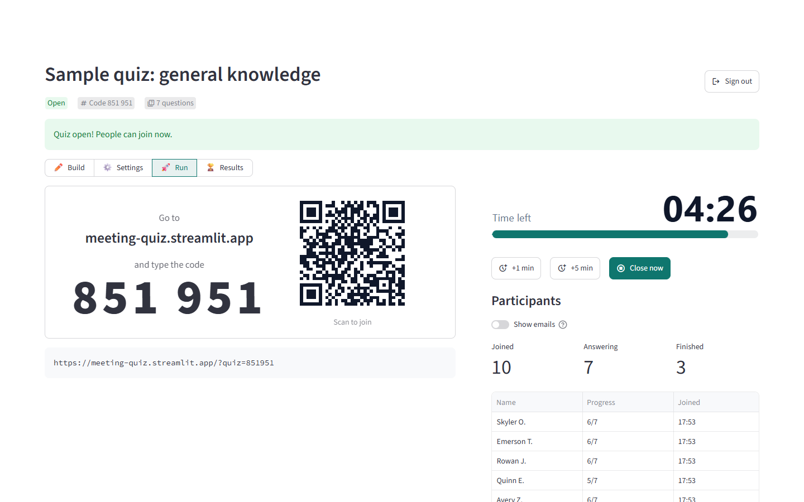
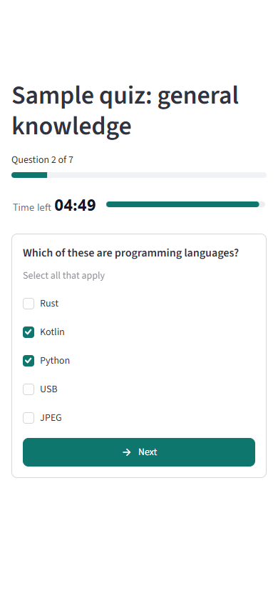
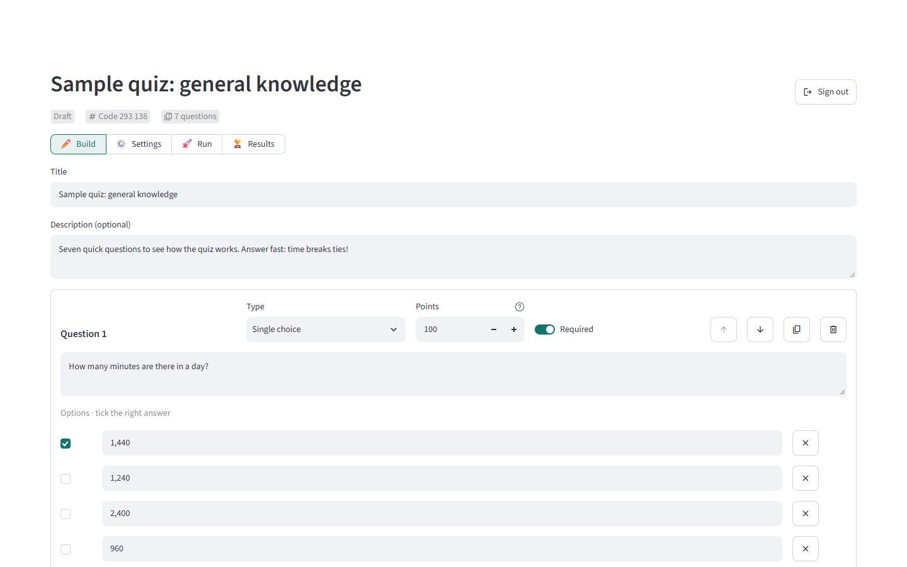
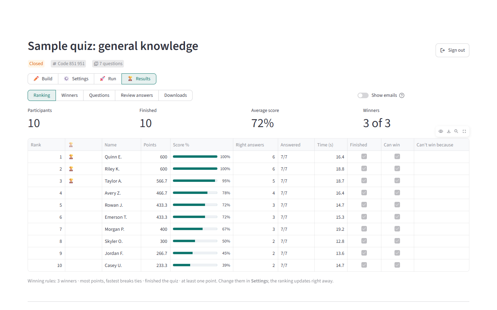
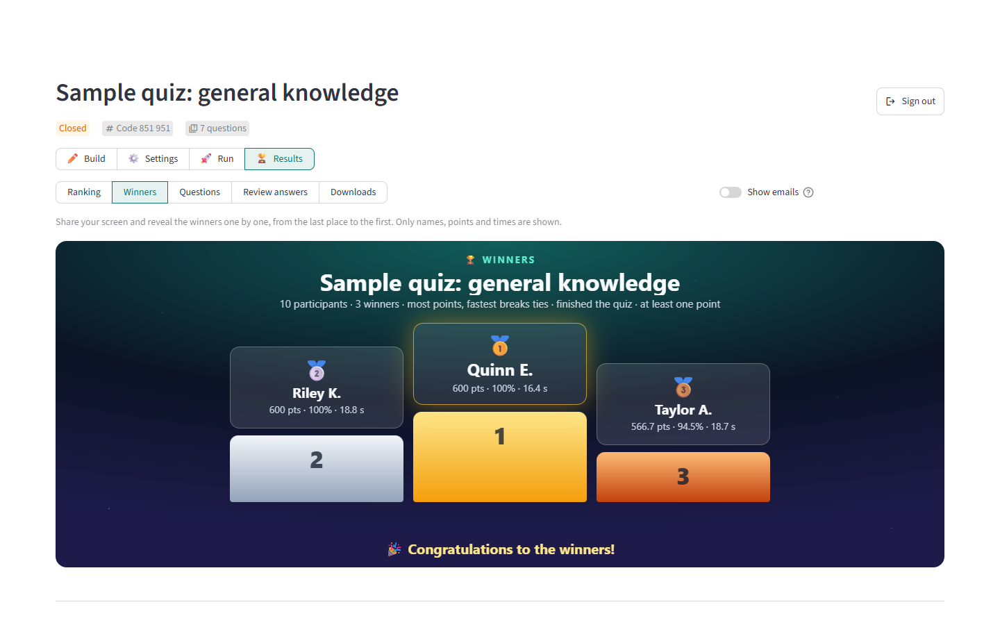
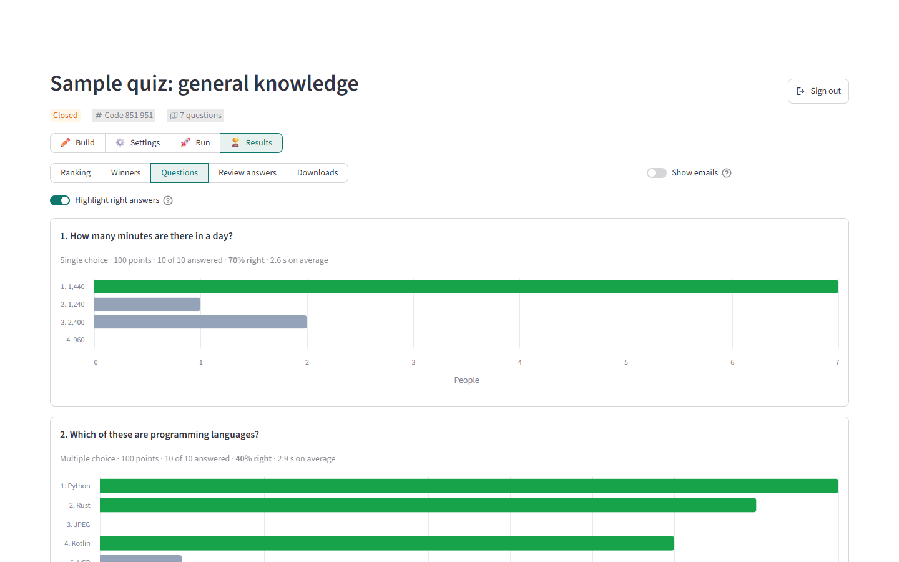
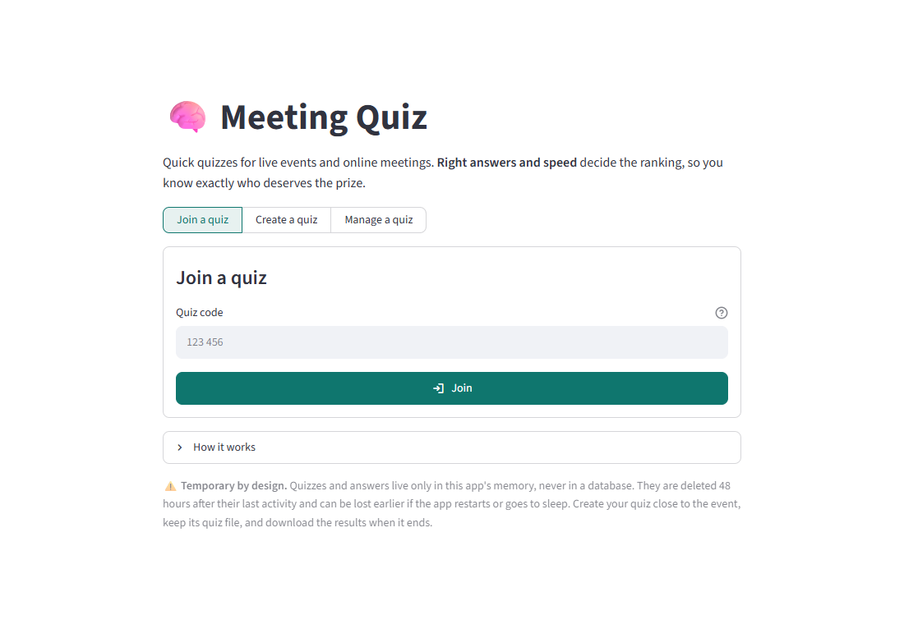

# 🧠 Meeting Quiz

Quick quizzes for live events and online meetings (Microsoft Teams, Zoom, Google Meet or a room with a projector).
Share a code on screen, people answer on their phone or laptop, and the ranking counts **right answers and speed**, so
you know exactly who deserves the voucher.

No accounts, no database, nothing to install for participants.

**Demo here:** https://meeting-quiz.streamlit.app/



## Highlights

- **Private by default.** Every quiz gets a 6-digit code for participants and a separate **admin key** for the
  person who created it. Only the admin sees right answers, emails and results.
- **Three question types.** Single choice, multiple choice (with optional partial credit) and open answers (with
  accepted answers, typo tolerance and manual review). Questions can be required or optional, and a question worth
  0 points works as a poll or feedback question.
- **Fair ranking.** Time is measured by the server, question by question. Rank by *most points, then fastest* or by
  *points with a speed bonus*.
- **Timer for everyone.** Open the quiz for a few minutes. It closes by itself, and you can add time or close it early.
- **Winners on screen.** Choose how many winners and the rules (finished the quiz, minimum score, people who can't
  win), then reveal them one by one on a podium.
- **Everything in Excel.** Download names, emails, every answer, points, times and per-question statistics.
- **Safe for screen sharing.** Emails stay hidden unless you show them, and right answers are only highlighted when
  you choose.

## Screenshots

| Participants (phone) | Build the quiz |
|---|---|
|  |  |

| Ranking | Winners |
|---|---|
|  |  |

| Question statistics | Start page |
|---|---|
|  |  |

*Screenshots use fictional participants.*

## How to use

**Before the event**
1. Open the app, choose **Create a quiz** and give it a title. You can also start from the sample quiz or from a
   quiz file.
2. **Save the quiz code and the admin key.** The key is shown only once. You need both to manage the quiz from
   another tab or device.
3. In **✏️ Build**, add questions, tick the right options, set points and mark questions as required or optional.
4. In **⚙️ Settings**, choose the ranking, the number of winners and the winning rules. You can also ask for email,
   accept only some email domains or list people who can't win.
5. In **✏️ Build**, click **Save quiz file**. If the app forgets the quiz, you can recreate it in seconds.

**During the event**
1. Go to **🚀 Run** and share your screen. The audience sees the link, the QR code and the code.
2. Click **Open quiz**. People join with their name (and email), answer one question at a time and can't go back.
3. Follow who joined and finished in real time. Add a minute, or close the quiz early if everyone is done.

**After the quiz**
1. In **🏆 Results**, check the ranking. In **Review answers** you can accept open answers typed in other ways.
   If an answer key was wrong, fix it in **Build**: the ranking updates right away.
2. Open **Winners** and reveal them from the last place to the first.
3. In **Downloads**, get the full results in Excel.

## Scoring and winners

| Setting | What it does |
|---|---|
| Points per question | 100 by default. 0 turns the question into a poll that doesn't count. |
| Partial credit (multiple choice) | Each right pick earns part of the points and each wrong pick takes part away. Without it, all points go only to exactly the right options. |
| Accepted answers (open answers) | Case, accents and punctuation don't matter. *Accept small typos* also accepts answers like "Jupyter" for "Jupiter", except answers with numbers. |
| Review answers | Mark any open answer right or wrong by hand; it overrides the automatic check. |
| Most points, then fastest | Points decide the ranking. For equal points, less total time ranks higher. |
| Points with a speed bonus | A right answer earns up to 50% extra points, and the bonus shrinks to zero over the bonus window (20 s by default). |
| Winners | How many prizes. People who don't meet the rules are skipped, so the prize goes to the next person. |
| Winning rules | Must finish the quiz, minimum score (%), at least one point, and a list of emails that can't win (for example organizers or previous winners). |

The time for each question counts from the moment the server shows it to the participant until their answer
arrives. Reloading the page doesn't restart the clock.

## Privacy and security

- **Two secrets.** The 6-digit code only lets people *answer* while the quiz is open. The admin key is a random
  12-character key (about 60 bits). It is shown once and only a salted PBKDF2 hash is kept. It is never put in a
  link, so it doesn't appear on a shared screen.
- **Right answers stay on the server.** Participants only receive the question and its options. They never see
  accepted answers, right options, scores or other people's answers.
- **Rules are enforced on the server.** Joining after the timer, answering out of order, answering twice, skipping
  required questions and editing questions after people joined are all refused by the store, not just hidden in the
  interface.
- **Safe rendering.** Text typed by people is escaped before it's shown, and exported files neutralize spreadsheet
  formulas.
- **Brute-force friction.** Wrong codes and admin keys are rate-limited per session. A 6-digit code isn't a
  password, though: anyone who gets it can join while the quiz is open. The admin can remove participants and
  accept only some email domains.
- **Minimal data.** Only names, emails (optional) and answers are collected. They are deleted automatically. The
  admin can also delete the quiz at any time.

## Temporary by design

Quizzes live only in the app's memory:

- A quiz is deleted **48 hours after its last activity**.
- Everything is lost if the app **restarts**: a crash, a new deployment or a reboot.
- On [Streamlit Community Cloud](https://streamlit.io/cloud), apps **go to sleep after 12 hours without visitors**, and
  sleeping clears the memory too.

Recommended routine:
1. Create the quiz close to the event, or recreate it from its **quiz file** a few minutes before starting.
2. Open the app a few minutes early, so it's awake when the audience arrives.
3. Download the Excel results right after the event.

## Capacity

Every interaction runs on the server, so CPU is what limits how many people can answer at the same time.
`.streamlit/config.toml` turns off two Streamlit features that cost far more CPU than the quiz itself: checking every
module for code changes and a full garbage collection after each interaction.

Measured on a laptop, each answer costs about **50 ms of server CPU**, and idle participants cost almost nothing.
One core therefore handles roughly 20 answers per second. People usually take a few seconds per question, so that's
enough for well over a hundred people answering together. Streamlit Community Cloud shares CPU between apps, so for
large audiences (several hundred people) run the app on a machine you control.

## Run it locally

```bash
python -m venv .venv
source .venv/bin/activate        # Windows: .venv\Scripts\activate
pip install -r requirements.txt
streamlit run streamlit_app.py
```

Then open http://localhost:8501. To let people on the same network join, share your machine's network address
(Streamlit prints it when it starts).

## Deploy on Streamlit Community Cloud

1. Push this repository to GitHub.
2. On [share.streamlit.io](https://share.streamlit.io), create an app with `streamlit_app.py` as the main file.
3. Open the app once to check the join link on the **Run** page. If the link doesn't match the address people
   should use, set `QUIZ_PUBLIC_URL` (for example `https://your-quiz.streamlit.app`) as a root-level secret.
   Root-level secrets are also available as environment variables.
4. After pushing code changes, **reboot the app** from the Community Cloud menu so they apply. Rebooting clears
   quizzes, so don't do it during an event.

The app runs a single process and keeps everything in memory. Don't run several replicas behind a load balancer:
each replica would have its own quizzes.

## Limits

| Item | Limit |
|---|---|
| Questions per quiz | 50 |
| Options per question | 10 |
| Participants per quiz | 3,000 |
| Participants across the app | 20,000 |
| Quizzes held at once | 500 |
| Winners per quiz | 50 |
| Time limit | 24 hours |

## Development

```bash
pip install -r requirements-dev.txt
pytest
```

The tests cover the store rules, scoring, quiz files, exports, HTML escaping and complete flows through the app with
Streamlit's `AppTest`. The app supports Streamlit 1.50 and later; on versions whose `AppTest` can't drive segmented
controls, the app flow tests are skipped.

```
streamlit_app.py        pages: start, admin (Build, Settings, Run, Results) and participant
quiz/models.py          questions, settings, participants and answers
quiz/store.py           in-memory store: every rule, lock and limit
quiz/scoring.py         grading, ranking, winners and question statistics
quiz/quizfile.py        quiz files (JSON) to save and recreate quizzes
quiz/export.py          ranking tables, CSV and Excel
quiz/widgets.py         countdown and winners podium (countdown.html, winners.html)
quiz/samples.py         the sample quiz
```
